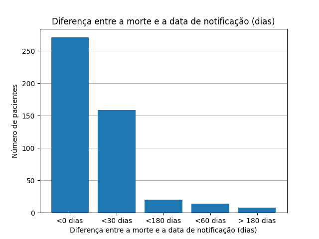

# MC853 - Projetos em Sistemas de Programação


## Relatório para descrição do banco de dados no formato atributo-alvo para notificações de pacientes com esquistossomose

**Alunos:**

*Lucca Miranda Nunes | 230554*

*Luiz Felipe Corradini Rego Costa | 230613*

*Pablo Henrique Almeida Mendes | 230977*

# Trabalho 1

### 1. Visão Geral

Este relatório busca descrever os passos realizados para obtenção do banco de dados no formato atributo-alvo com informações acerca de pacientes diagnosticados com esquistossomose. Para a construção da base de dados, foram utilizados dados disponibilizados no SINAN, referentes à ficha de notificação de pacientes que contraíram o parasita schistosoma mansoni entre os anos de 2020 e 2023. 

Primeiramente, o critério principal escolhido para a definição de uma doença dentre as diversas mostradas no site do SINAN foi a da taxa de mortalidade. Com uma taxa de mortalidade muito pequena, as diferentes classes poderiam estar pouco representadas no momento em que fossem treinados modelos com os dados em questão. Por isso, o grupo avaliou algumas doenças que ainda não haviam sido escolhidas por outros grupos, e chegou a conclusão que a taxa de mortalidade de 4.37% da esquistossomose era suficiente para prosseguir o trabalho com a doença.

Além disso, em função da ausência de dados referentes aos períodos de 2024 à 2025, o grupo optou, inicialmente, por utilizar os dados do ano de 2023. Porém, em virtude da esquistossomose apresentar relativamente menos casos anuais comparado à outras doenças presentes na base, o grupo optou por selecionar os dados da janela de 2019 à 2023, com o intuito de aumentar a quantidade total de dados obtidos.

O código do projeto está disponibilizado em https://github.com/lipecorradini/mc853. O tratamento dos dados foi realizado majoritariamente pela biblioteca Pandas, do Python, e o código comentado está disponibilizado em um jupyter notebook, no mesmo link do GitHub.


## 2. Etapas de Pré-processamento Realizadas

O pré-processamento realizado envolveu uma série de etapas distintas, na qual em cada uma tiveram que ser tomadas decisões importantes para o seguimento do projeto. 

Primeiramente, foi necessário filtrar os dados que seriam utilizados para o desenvolvimento da base de dados. Como haviam 5 outputs distintos possíveis (Cura, Não-Cura, Óbito por Esquistossomose, Óbito por outras causas, Ignorado), o grupo optou, inicialmente, por considerar apenas os casos de "Cura" e "Óbito por esquistossomose". Porém, a porcentagem de óbitos frente ao total ainda se mostrou baixa, representando apenas 4% do total. Por isso, o grupo optou por adicionar também as mortes por outras causas na base, conscientes de que isso muda a abordagem do problema em questão.


### 2.1 Seleção de Variáveis

Com base na análise exploratória, pesquisa sobre o assunto e no conhecimento prévio sobre a doença, foram selecionadasas seguintes 10 variáveis consideradas de maior relevância preditiva:

```python
colunas_selecionadas = [
    'CS_GESTANT',  # Status de gestação
    'AN_QUANT',    # Quantidade de ovos encontrados
    'AN_QUALI',    # Exame qualitativo
    'TRATAM',      # Tratamento realizado
    'FORMA',       # Forma clínica da doença
    'CS_ESCOL_N',  # Escolaridade
    'CS_SEXO',     # Sexo biológico
    'ANO_NASC',    # Ano de nascimento
    'COUFINF',     # Unidade Federativa
    'EVOLUCAO'     # Resultado (variável alvo)
]
```
A escolha foi realizada avaliando todas as variáveis disponíveis, e considerando aquelas que julgamos mais relevantes para o futuro treinamento do modelo. Além disso, as bases de dados da dengue disponibilizada no classroom também influenciaram na escolha de algumas das features em questão. 

Em virtude da doença escolhida não apresentar variáveis referentes aos sintomas dos pacientes, as features utilizadas vieram a contemplar uma natureza mais voltada para após o início do tratamento do paciente, onde este já tenha realizado exames e tratamentos distintos.

### 2.2 Tratamento de dados incorretos e definição do problema

Após a realização da análise acerca das variáveis disponibilizadas no contexto da esquistossomose, o grupo chegou a conclusão, em alinhamento com os docentes, de que o mais correto seria considerar o problema a partir da data que o paciente inicia o tratamento, a fim de obter um melhor aproveitamento das variáveis disponibilizadas pela doença.

Para isso, o primeiro passo no tratamento dos dados incorretos seria avaliar apenas aqueles pacientes que possuem data de início do tratamento.


Como o dado de "Data de início de tratamento" era ausente em mais de 80% dentre todas as instâncias de pacientes que vieram a óbito, a remoção desses dados levaria a uma perda considerável de informação pelo modelo. 

Além disso, dos que restavam, em uma porcentagem considerável a morte havia acontecido mais de 180 dias após o tratamento, o que poderia indicar uma morte por outro fator que não a esquistossomose, e então não auxiliaria no treinamento do modelo.

Por isso, optamos por também avaliar a distribuição das mortes frente à diferença na data de óbito e na de notificação.



Agora, pudemos notar que não existem mais dados ausentes (ou seja, todo paciente possui uma data de notificação). Porém, ainda existem diversos casos nos quais a data de notificação é posterior à data da morte, o que pode considerar casos em que todas as notificações foram acumuladas e registradas ao final de certo período de tempo, por exemplo.

Portanto, a partir dessa análise, tomamos como premissa considerar o nosso problema de predição a partir da data de notificação. Removemos todas as instâncias nas quais a diferença era menor que 0 (noificação posterior à morte) e todos aqueles casos que a diferença superava 180 dias (óbito teve possivelmente origem em outro fator).


### 2.3 Tratamento das variáveis categóricas

Como cada feature exigiu um processo distinto de tratamento a depender da natureza dos dados, foi necessário avaliar cada uma e decidir pela melhor técnica de tratamento.

#### 2.3.1 Gestante

Como haviam 6 outputs distintos para a variável Gestante, e esses não apresentavam uma lógica de cardinalidade explícita, foi necessário filtrar as colunas, a fim de que a coluna contesse apenas 0 e 1 (grávida ou não-grávida).

Porém, ao concluir o tratamento, notamos que uma quantidade ínfima dos dados (aproximadamente 0.1% dos pacientes) apresentavam gravidez, e dentre esses, nenhuma havia ido à óbito. Por isso, o grupo tomou a decisão de remover a feature da base de dados, visto que entendemos que não auxiliaria na tarefa final de predição do óbito.

#### 2.3.2 Quantidade de Ovos

O atributo "Quantidade de Ovos encontrados" já se encontrava em forma binária, indicando se não foram encontrados ovos da Schistossoma no exame de fezes (0) ou se foram encontrados (1). Por isso, não foi necessário realizar o tratamento.

#### 2.3.3 Exame qualitativo

Já para o atributo "Resultado exame ovos qualitativo", que indica o resultado (1=Positivo, 2=Negativo e 3=Não realizado), como são apresentadas mais de duas categorias, será necessário transformar em mais colunas.

Além disso, como existem muitos valores nulos na coluna, vamos atribuí-los a uma quarta categoria: Desconhecido. Essa última categoria poderá ser removida posteriormente na etapa de treinamento do modelo, visto que pode não contribuir para a identificação do problema.

#### 2.3.4 Tratamento Realizado

A categoria apresenta o tratamento que foi realizado pelo paciente no combate à doença, sendo 1=  Sim  –  Praziquantel,  2=  Sim - Oxaminiquine,  3=  Não  ou  9=  Ignorado. De maneira análoga à feature anterior, foi realizado o *One-Hot encoding* a fim de serem obtidas colunas para cada uma das categorias distintas.

#### 2.3.5 Forma clínica avaliada

De maneira análoga às features anteriores, apresentava 5 categorias distintas (Intestinal, Hepato-Intestinal, Hepato-Esplênica, Aguda e Outra). Cada categoria foi transformada em uma coluna distinta.

#### 2.3.6 Escolaridade

Como o campo escolaridade apresenta uma cardinalidade lógica, ou seja, o "1" = 1º a 4º série incompleta e "8" = Educação superior completa, podemos considerá-lo como um atributo numérico, e não é necessário realizar o *One-Hot-Encoding*.

Porém, como os atributos "9" e "10" são Ignorado e Não se aplica, respectivamente, transformamos-os em "0" para garantir que não sejam considerados com uma cardinalidade maior que a Educação superior completa.

#### 2.3.7 Sexo Biológico

Como apenas três valores eram apresentados, sendo o terceiro ("Ignorado") contendo apenas 3 instâncias no total, optamos por remover as instâncias que continham tal valor. 

#### 2.3.8 Ano de Nascimento

Como o grupo compreendeu que a "Idade" seria um campo mais representativo do que o ano de nascimento do paciente, para o tratamento da feature em questão bastou realizar a subtração do ano da notificação pelo ano de nascimento do paciente, a fim de obter sua idade. 

#### 2.3.9 Unidade Federativa

Para este campo, o grupo optou por dividir as instâncias em regiões do brasil, ao invés de "Unidade Federativas", como apresentado pela base de dados original. A motivação para tal mudança era analisar a viabilidade de utilizar um critério geográfico para divisão dos dados entre treino e teste.

Para isso, foi necessário consultar a Tabela de Códigos de Municípios do IBGE, a fim de identificar cada estado presente na base de dados original e atribuí-lo à região correspondente.

Com isso, 5 colunas referentes às 5 regiões do país foram adicionadas à base de dados final. Além disso, explorando a divisão por região, verificamos que aproximadamente 70% dos casos eram provenientes apenas das regiões nordeste e sudeste. Por isso, optaremos por realizar a divisão dos dados entre treino e teste a partir do critério temporal.

## 3. Divisão de Treino e Teste

A divisão entre treino e teste foi realizada seguindo como base o critério temporal. Para isso, utilizamos todas as instâncias do ano mais recente (2023) e as separamos como o caso de teste, o que resultou em, aproximadamente, 20% das instâncias totais do dataset.

Em relação a representatividade das classes, a porcentagem de mortalidade ainda se mostra reduzida a fim de treinar um modelo devidamente balanceado. Por isso, estratégias para mitigar esse desbalanceamento serão mostradas no relatório de descrição do trabalho 2.

## 4. Exploração dos dados

### 4.1 Distribuição de Idades dos Pacientes

 Ao analisar a distribuição das idades podemos notar que a grande maioria dos casos condiz com a PIA (População em Idade Ativa), indicando uma possível correlação de atividades laborais com a infecção pela doença.

### 4.2 Distribuição por Regiões

 A observação das regiões pode trazer uma correlação com os casos e seus espaços geográficos, incluindo fatores climáticos e sociais. Entretanto, a ausência de região em uma quantidade considerável de casos é capaz de afetar essa análise, trazendo, portanto, um ponto para ser observado em etapas futuras do projeto. 

### 4.3 Heatmap de Correlação de Atributos

 Analisando as correlações entre as features escolhidas, é possível notar que poucas apresentam correlação próxima de 1 (ou seja, dependente linearmentes). Porém, o heatmap também evidencia correlações acima da média, como entre Quantidade de Ovos e Diagnóstico positivo, indicando que uma futura análise acerca da linearidade entre essas features pode ser realizada na etapa de treinamento do modelo, a fim de evitar variáveis linearmente dependentes.

# Trabalho 2
